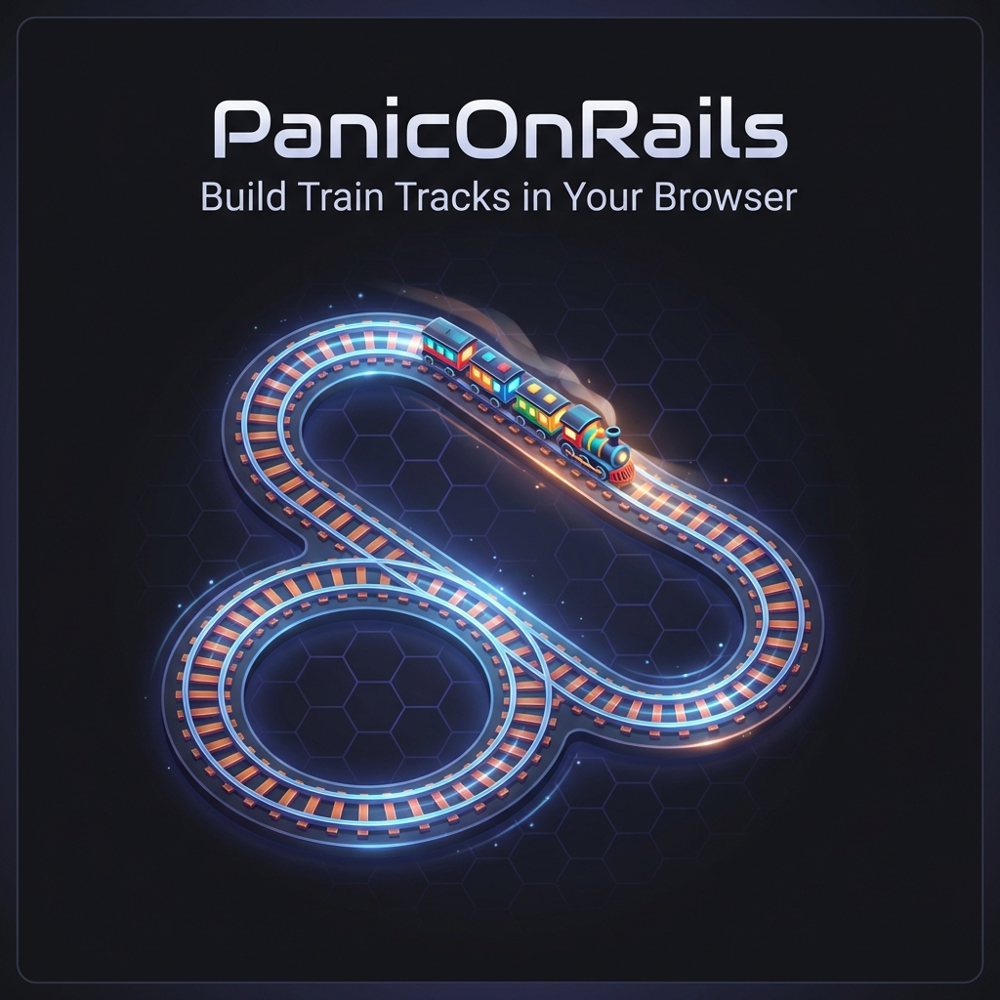

# 🚂 PanicOnRails

> **A virtual model railway in your browser: real starter sets, real track, trains that run.**

[](https://panic-on-rails.chayuto.com/)
[](https://opensource.org/licenses/MIT)
[](https://github.com/chayuto/panic-on-rails)



## What is PanicOnRails?

Model trains are wonderful, but the boxes are expensive and the table is never big enough. PanicOnRails is a **virtual model railway** for everyone who loves the hobby without the budget or the space.

1. **Open a real starter set.** The Kato Unitrack M1 box, for example, holds four 248 mm straights, eight R315 curves, a feeder and a rerailer, just as in the shop.
2. **Build the layouts from its manual,** or your own. Every piece is a real product with its real geometry, so if it closes here it closes on your table.
3. **Run your trains.** Throw switches, set signals, and try not to crash.

**🎮 [Try it now - no download required!](https://panic-on-rails.chayuto.com/)**

### Key Features

- 📦 **Real boxed sets:**
  - Kato Unitrack master sets and the expansion sets that extend them.
  - Exact contents and layout plans. Tests prove every plan closes.
- 🛤️ **Accurate track:**
  - Kato N-scale geometry: straights, R216–R718 curves, #4/#6 turnouts, crossings and
    crossovers.
  - Brio and IKEA wooden track too.
- 🚂 **A real running simulation:**
  - Trains follow the track graph through switches and stop at red signals.
  - Sensors can automate switches.
  - Two trains on one line end in a spectacular crash.
- 🌐 **Runs in your browser:** no install, free and open source (MIT).
- 💾 **Save & share:** export and import layouts as JSON.

See [`docs/ROADMAP.md`](docs/ROADMAP.md) for where it's going: a collection you grow with
virtual money earned by running trains, power-pack driving, and more brands.

## Why PanicOnRails?

| Feature | PanicOnRails | Desktop Apps | Physical Planning |
|---------|-------------|--------------|-------------------|
| **No installation** | ✅ | ❌ | ✅ |
| **100% Free** | ✅ | ⚠️ Often paid | ❌ Requires tracks |
| **Shareable layouts** | ✅ JSON export | ⚠️ Proprietary | ❌ |
| **Kato N-Scale accurate** | ✅ | ⚠️ Varies | ✅ |
| **Instant access** | ✅ | ❌ Download needed | ❌ Setup required |

## Technology Stack

| Technology | Purpose |
|------------|---------|
| React 19 + TypeScript | UI Framework |
| Vite | Build System |
| React-Konva | Canvas Rendering |
| Zustand | State Management |
| pnpm | Package Manager |

## Getting Started

### Quick Start (Development)

```bash
# Clone the repository
git clone https://github.com/chayuto/panic-on-rails.git
cd panic-on-rails

# Install dependencies
pnpm install

# Start development server
pnpm run dev
```

Open [http://localhost:5173/](http://localhost:5173/) in your browser.

### Build for Production

```bash
pnpm run build
```

### Run Tests

```bash
pnpm run test      # Unit tests
pnpm run lint      # Linting
pnpm run typecheck # TypeScript checks
```

## Frequently Asked Questions

<details>
<summary><strong>Is PanicOnRails really free?</strong></summary>

Yes! PanicOnRails is 100% free and open source under the MIT license. No ads, no subscriptions, no hidden costs. Free forever.
</details>

<details>
<summary><strong>Does it work on mobile/tablet?</strong></summary>

PanicOnRails is designed desktop-first for precision track placement, but works on tablets. Mobile phones are not recommended due to screen size limitations.
</details>

<details>
<summary><strong>Can I export my layouts?</strong></summary>

Yes! Layouts can be exported as JSON files for sharing, backup, or importing on another device. Layouts are also saved automatically to your browser's local storage.
</details>

<details>
<summary><strong>What track types are supported?</strong></summary>

Currently focused on Kato N-Scale with accurate track geometry. More track types are planned for future releases.
</details>

## Project Status

🚧 **Under Active Development**

**Current Capabilities:**
- ✅ Track placement and visualization
- ✅ Pan and zoom controls
- ✅ Layout persistence (local storage)
- ✅ File export/import (JSON)
- ✅ Snap-to-connect track placement
- ✅ Train simulation with graph-based movement, switches, sensors and crashes
- ✅ Undo/redo
- ✅ Headless, deterministic simulation core (for tests and agents)

**Next:** see [docs/ROADMAP.md](docs/ROADMAP.md) for the current assessment and the phased plan.
This covers making the controls real (signals, switches, per-train control), then a mission layer
with objectives and progression, then feel and polish.

## Contributing

Contributions are welcome! Please see [CONTRIBUTING.md](CONTRIBUTING.md) for guidelines.

1. Fork the repository
2. Create your feature branch (`git checkout -b feature/amazing-feature`)
3. Commit your changes (`git commit -m 'Add amazing feature'`)
4. Push to the branch (`git push origin feature/amazing-feature`)
5. Open a Pull Request

## License

MIT License — See [LICENSE](LICENSE) for details.

---

**Built with 💙 by [Chayuto](https://github.com/chayuto)**
