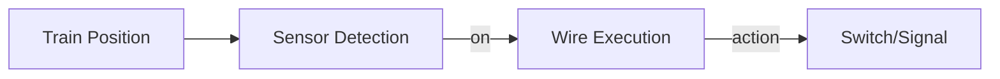

# Sprint 2A Completion Report

**Date:** 2026-01-02  
**Sprint:** 2A (Phase 2 - Logic Engine)  
**Status:** ✅ Complete

---

## Summary

Sprint 2A implements the Logic Engine from Phase 2 roadmap:

- **Sensors** — Yellow zones on tracks that detect train presence
- **Signals** — Red/green lights at nodes (click to toggle)
- **Wires** — Bezier curve connections for automation
- **Automation** — Sensor triggers switch/signal changes via wires

---

## New Files Created

| File | Purpose |
|------|---------|
| `src/types/logic.ts` | Sensor, Signal, Wire type definitions |
| `src/stores/useLogicStore.ts` | CRUD actions with persistence |
| `src/components/canvas/SensorLayer.tsx` | Yellow sensor zone rendering |
| `src/components/canvas/SignalLayer.tsx` | Red/green signal rendering |
| `src/components/canvas/WireLayer.tsx` | Bezier wire rendering |

---

## Modified Files

| File | Changes |
|------|---------|
| `src/types/index.ts` | Re-export logic types, extended EditorMode |
| `src/hooks/useGameLoop.ts` | Sensor detection, wire action execution |
| `src/components/ui/Toolbar.tsx` | 📡🚦🔌✏️ tool buttons |
| `src/components/canvas/StageWrapper.tsx` | Integrated logic layers |

---

## Verification Results

```
✅ TypeScript: Pass
⚠️ ESLint: 1 warning (intentional)
✅ Tests: 8/8 Pass
```

---

## Features Implemented

### Sensors
- Yellow rectangular zones on track edges
- Glow effect when train present
- Click to remove in sensor mode

### Signals  
- Red/green lights with post visualization
- Glow effect based on state
- Click to toggle in edit/simulate mode

### Wires
- Bezier curve connections between components
- Yellow when source active, gray when inactive
- Dashed when inactive, solid when active

### Automation Logic
- Sensor detects train within zone (distance < length/2)
- Wire triggers action when sensor activates
- Actions: toggle, set_main, set_branch, set_red, set_green

### Toolbar
- 📡 Sensor — Place sensors on tracks
- 🚦 Signal — Place signals at nodes
- 🔌 Wire — Connect components
- ✏️ Edit — Return to edit mode

---

## Architecture



---

## Total Implementation: Sprints 1A + 1B + 2A

| Sprint | Features |
|--------|----------|
| 1A | Audio, bounce animation |
| 1B | Switches, crash detection |
| 2A | Sensors, signals, wiring |
